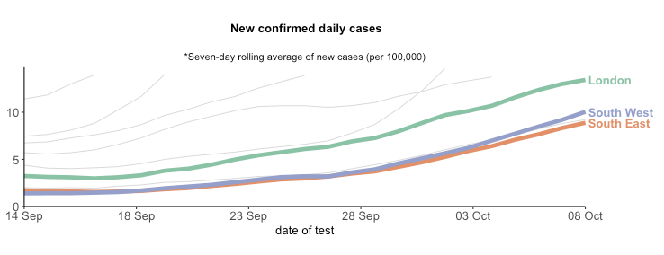
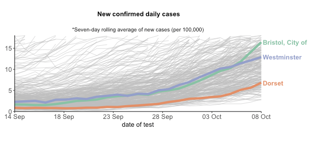
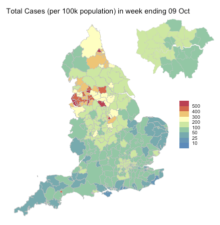
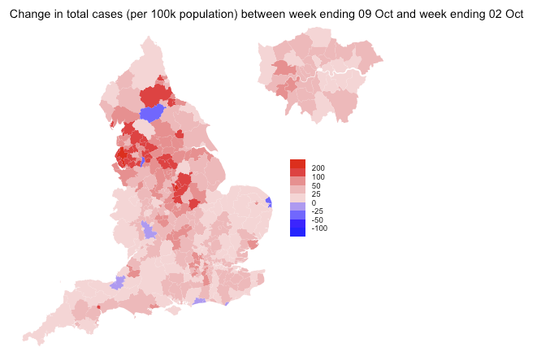

# covid19_eng_dashboard

**Note: As of 26/04/21 the format of the case data on coronavirus.data.gov.uk has changed and the dashboard is no longer working**

Dashboard for COVID-19 case counts in England

https://covid19eng.shinyapps.io/dashboard/

Displaying:

**1) Regions: new daily cases in regions**

**2) Local Authorities: new daily cases in local authorities**

**3) Map of Weekly Cases: weekly total number of cases across local authorities**

**4) Map of Change in Weekly Cases: weekly changes in total number of cases across local authorities**

